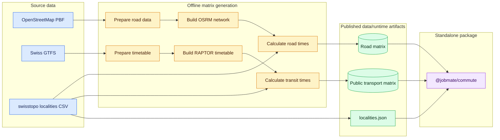

# Jobmate Commute

Precomputed travel times between 4,073 Swiss localities.

The repository has a deliberately asymmetric design: generating the matrices
contains the routing complexity; consuming them is a direct array lookup.



## Download source data

Run these commands from the repository root. They require `curl` and `unzip`
and place each source at the path expected by the preparation commands.

```sh
mkdir -p data/raw/gtfs data/raw/osm

# Latest WGS84 locality directory from swisstopo (updated monthly)
curl -fL \
  https://data.geo.admin.ch/ch.swisstopo-vd.ortschaftenverzeichnis_plz/ortschaftenverzeichnis_plz/ortschaftenverzeichnis_plz_4326.csv.zip \
  -o data/raw/ortschaftenverzeichnis_plz_4326.csv.zip
unzip -p data/raw/ortschaftenverzeichnis_plz_4326.csv.zip \
  AMTOVZ_CSV_WGS84/AMTOVZ_CSV_WGS84.csv \
  > data/raw/AMTOVZ_CSV_WGS84.csv

# Latest Swiss GTFS feed for timetable year 2026
curl -fL \
  https://data.opentransportdata.swiss/en/dataset/timetable-2026-gtfs2020/permalink \
  -o data/raw/swiss-gtfs.zip
unzip -o data/raw/swiss-gtfs.zip -d data/raw/gtfs

# Hourly Switzerland extract from the Swiss OpenStreetMap Association
curl -fL \
  https://planet.osm.ch/switzerland-padded.osm.pbf \
  -o data/raw/osm/switzerland-latest.osm.pbf
```

The GTFS permalink follows the newest published feed for timetable year 2026,
which contains the configured service date. When changing the service date to
another timetable year, switch the permalink to that year's dataset as well.

## Commands

Road preparation and matrix generation require Docker with its daemon running
and permission to run `docker` commands. The scripts use the pinned OSRM image
from `src/config.ts`.

```sh
npm install

npm run public-transport:prepare
npm run public-transport:matrix

npm run road:prepare
npm run road:matrix

npm run commute:package:data
npm run commute:package:build
npm run commute:package:pack
npm run commute:package:verify

npm test
npm run typecheck
npm run lint
```

See [PUBLISHING.md](./PUBLISHING.md) for the npm account, verification, and
release procedure for `@jobmate/commute`.

Preparation and matrix commands skip complete outputs. Pass `-- --restart` to
replace an output or incompatible checkpoint intentionally.

After replacing the downloads in `data/raw`, rebuild both prepared datasets and
matrices explicitly; existing outputs are not invalidated by newer raw files:

```sh
npm run public-transport:prepare -- --restart
npm run public-transport:matrix -- --restart
npm run road:prepare -- --restart
npm run road:matrix -- --restart
npm run commute:package:data
```

Then repeat the package build, pack, verification, and checks above. Restart any
running API process so it loads the new package data, and reload the viewer.

## Generated artifacts

The two generators publish finished artifacts directly under `data/runtime`:

```text
data/runtime/
  localities.json
  public_transport/
    manifest.json
    travel-times.bin
  road/
    manifest.json
    travel-times.bin
```

`travel-times.bin` is a dense, directional, row-major `UInt8` matrix. The
position of each locality in `localities.json` is its row and column index.
Values `0` through `240` are whole travel minutes; `255` means unavailable
within four hours.

The locality array is the sole index. Its count and IDs are not repeated in
either manifest. A manifest is operational metadata only:

```json
{
  "date": "2026-08-31T11:43:01.642Z",
  "fingerprint": "…matrix SHA-256…",
  "source": {
    "dataset": "…short source description…"
  }
}
```

`npm run commute:package:data` creates the ordered locality array from the
official CSV and adds the selected station names recorded by the public-transport
compiler. It checks that each matrix has exactly `N × N` bytes and writes the
locality array, matrices, and provenance manifests to `packages/commute/data`.
Station names live in the packaged locality array; the compiler's station-name
column is omitted from the packaged manifest. Runtime loading reads only the
locality array and two matrices.

## Road matrix

Inputs:

```text
data/raw/osm/switzerland-latest.osm.pbf
data/raw/AMTOVZ_CSV_WGS84.csv
```

`npm run road:prepare` runs the pinned OSRM extraction and contraction steps
and writes the routable network to `data/processed/road/network`.

`npm run road:matrix` starts the pinned `osrm-routed` Docker container, waits
for it to become ready, snaps the ordered localities, requests bounded OSRM
table blocks, and stops the container after publishing the matrix. Its
resumable work files live in `data/processed/road/matrix-build` and are removed
after publication.

To use an already-running local or remote OSRM service instead, pass its URL
explicitly:

```sh
npm run road:matrix -- --osrm-base-url http://host:5000
```

## Public-transport matrix

Inputs are the Swiss GTFS files under `data/raw/gtfs` and the same official
locality CSV.

`npm run public-transport:prepare` retains only normalized stops and the
fixed-day trip stream needed for the configured representative morning. The
result lives under `data/processed/public_transport`.

`npm run public-transport:matrix` builds the compact timetable and locality
stop mapping in memory, runs the Range-RAPTOR queries, and writes the final
matrix. Complete origin rows are checkpointed under
`data/processed/public_transport/matrix-build`.

Routing currently represents departures from 07:00 through 12:00 on the
configured service date, with at most five transfers and a four-hour result
horizon. Each locality is represented by one active physical station, with zero
access and egress time. A station is active when a passenger can board a trip
in the window and alight at another physical station.

Station selection is configured in `src/config.ts` under
`publicTransport.localityAccess`:

```ts
localityAccess: {
  preferredRadiusMeters: 500,
  railDepartureBoostPercent: 25,
}
```

Within the preference radius, the station with the highest score wins:
`usable departures + usable rail departures × boost percent / 100`.
Each concrete trip counts once per physical station; platform duplicates do
not increase its score. Only usable rail departures in the configured window
receive the bonus, including at stations shared by buses and trains. Set the
bonus to zero to rank all departures equally. Equal scores prefer the nearer
station, then its ID for deterministic ties.

When no active station lies within the radius, the nearest active station is
selected without a distance cap or rail preference. Distances are straight-line
approximations. An empty active-station list leaves the locality unavailable.
Station activity and selection stay in the matrix compiler; they do not cross
into the standalone package. The matrix build also reads `routes.txt` from the
same raw GTFS feed to classify standard and extended passenger rail services.
After changing either setting, run `npm run public-transport:matrix -- --restart`
to regenerate the matrix. The prepared trip stream can be reused.

## Standalone API

`@jobmate/commute` does not contain OSRM, OpenStreetMap, GTFS, RAPTOR, graph, or
timetable code. Its Node entry point reads the locality array and two matrices,
then exposes one small object:

```ts
import { loadCommuteRuntime } from '@jobmate/commute/node';

const runtime = await loadCommuteRuntime();
const origin = runtime.resolve({ postalCode: '8001', city: 'Zürich' });
const destination = runtime.resolve({ postalCode: '3011', city: 'Bern' });

if (origin && destination) {
  runtime.travelTime(origin, destination, 'road');
  runtime.travelTime(origin, destination, 'public_transport');
}
```

`resolve` accepts either a canonical locality ID or a postal-code/city query.
The additional `reachableLocalities(origin, maximum, mode)` row scan is kept
for the map viewer.

Loading performs only checks that give useful failure modes: locality JSON
must be readable and structurally usable, and each matrix must contain exactly
one byte for every origin/destination pair. Manifests are not parsed during
lookups.

## API and viewer

The Node API converts standalone reachability results to map-ready GeoJSON; the
Vue viewer remains a presentation-only HTTP client.

```sh
npm run commute:api:build
npm run viewer:build

npm run commute:api:dev
npm run viewer:dev
```

The HTTP mode values are the same as the standalone package:
`public_transport` and `road`. The browser receives locality and GeoJSON data,
never matrix bytes or routing internals.

## Use of coding agents

This project's goal is to generate the road and public-transport travel-time
matrices and distribute them through the `@jobmate/commute` package for use in
other projects. The matrix-generation code was written entirely by coding
agents. Its involved and sometimes verbose implementation is a deliberate trade-off: 
this repository primarily serves to generate data, and the resulting matrices have been
tested and found to provide plausible, useful travel times. The project's
main value lies in these tested outputs and their reuse in other projects.
